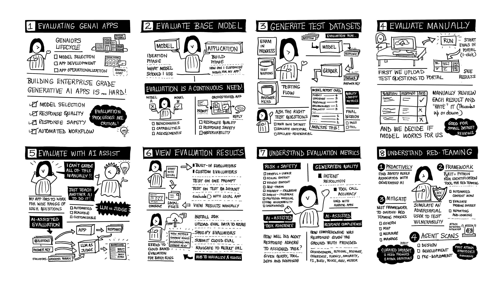

# Evaluate and improve the quality and safety of your AI applications"

## Description

You’ve built a custom AI application grounded in your enterprise data. **How do you ensure response quality and safety?** Join us as we explore AI-assisted evaluation workflows with built-in and custom evaluators on Azure AI. Learn what each metric represents, then understand how to analyze the scores for your specific application. Learn why observability is key, and how the generated telemetry can be used both locally, and in the cloud, to help you assess and debug your application performance.  

- **Level:** Intermediate/Advanced
- **Duration:** 75 minutes

---

## Pre-Requisites

To complete this lab you need:

1. A personal GitHub account → create one for free if needed
1. An Azure subscription → with quota for the required models
1. Familiarity with Python → and usage of Jupyter notebooks
1. Familiarity with Generative AI → basic tools and concepts

!!! note "IN-VENUE PARTICIPANTS: We will provide an Azure subscription for your use"
!!! note "AT-HOME PARTICIPANTS: We have guidance to use your own Azure subscription"

---

## The Evaluations Journey

In this lab, we want to build your intuition on **how, when, and where**, to apply _evaluation concepts and tools_ to build user trust and confidence in the generative AI solution you have developed. 

By the end of this journey you should know:

1. **What** evaluations are, and why they are critical to GenAIOps
1. **How to** use the Azure AI Foundry SDK for code-first evaluations
1. **How to** use the Azure AI Foundry portal to view & analyze reports
1. **How to** use the _Simulator_ capabilities to create evaluation datasets
1. **How to** run evaluations (local and cloud) using built-in evaluators
1. **How to** build and run custom evaluators for application-specific needs
1. **What** red teaming means, and how to do adversarial evaluations in Azure
1. **What** agentic AI needs, and how to tailor evaluations for AI agents in Azure

---

## Workshop vs. Homework

We cannot cover all concepts in the limited session time. Instead, we are organizing the content in two parts: **Workshop** and **Homework**. By the end of the Workshop track, you should have **a personal copy of the repository** that you can use as a sandbox, to continue exploring this at home - with your own Azure subscription.

- The Workshop track is designed to be completed in 60 minutes, in-venue.
- The Homework track is designed to be explored at your own pace.
- The instruction guide will provide details for each track for convenience.

---

## Questions & Feedback

We welcome feedback to help us improve the learning experience. 

1. [File an issue](https://github.com/microsoft/BUILD25-LAB334/issues/new). We welcome feedback on ways to improve the workshop for future learners.
1. [Join the Azure AI Foundry Discord](https://aka.ms/azureaifoundry/discord). Meet Azure AI community members and share insights.
1. [Visit the Azure AI Foundry Developer Forum](https://aka.ms/azureaifoundry/forum). Get the latest updates on Azure AI Foundry.
